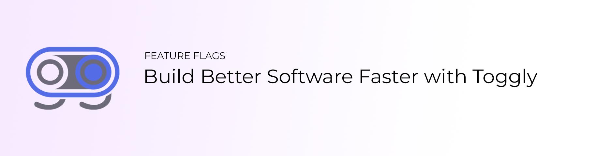

  

<h1 align="center">Toggly Samples</h1>

  Runnable example apps for <a href="https://toggly.io">Toggly</a> — feature flags, progressive delivery, and experiments across popular frameworks.

  
  
  
  

## What's in this repository

Official **sample applications** that show how to integrate Toggly SDKs in real apps. Each folder is a standalone project with its own README and setup steps.

## Get started

1. Create a free app at [toggly.io](https://toggly.io) (Always Free plan available).
2. Pick a sample from the catalog below.
3. Follow that sample's README (env keys, feature flags, and run commands).

SDK install guides live in [docs.toggly.io](https://docs.toggly.io) and in the [SDK monorepo](https://github.com/ops-ai/Toggly.FeatureManagement).

## Samples

| Sample | Stack | Path | What it demos |
|--------|-------|------|---------------|
| Next.js SDK Showcase | Next.js 15 (App Router) | [`nextjs-server-sdk/`](nextjs-server-sdk/) | Server Components, Client hooks, and Edge middleware with `@ops-ai/nextjs-toggly-*` |
| Fastify SDK Showcase | Fastify 5 | [`nodejs-fastify-sdk/`](nodejs-fastify-sdk/) | Request-scoped plugin context, native gates, Order and filter matrix with `@ops-ai/toggly-fastify` |

**Planned (Wave 1):** JavaScript (`javascript-sdk/`), React (`react-sdk/`),
Remix (`remix-sdk/`), Nuxt (`nuxt-sdk/`), Express (`nodejs-express-sdk/`),
Hono (`nodejs-hono-sdk/`), and Koa
(`nodejs-koa-sdk/`). These folders are listed as plans only and will be linked
when their samples land.

All new samples follow the [Sample Contract](docs/SAMPLE_CONTRACT.md) and the
shared [flag and app template](docs/FLAG_TEMPLATE.md).

## Related

- [Toggly.FeatureManagement](https://github.com/ops-ai/Toggly.FeatureManagement) — official SDKs
- [Documentation](https://docs.toggly.io)
- [Contributing](CONTRIBUTING.md) · [Security](SECURITY.md) · [Code of Conduct](CODE_OF_CONDUCT.md)

## License

MIT — see [LICENSE](LICENSE).
